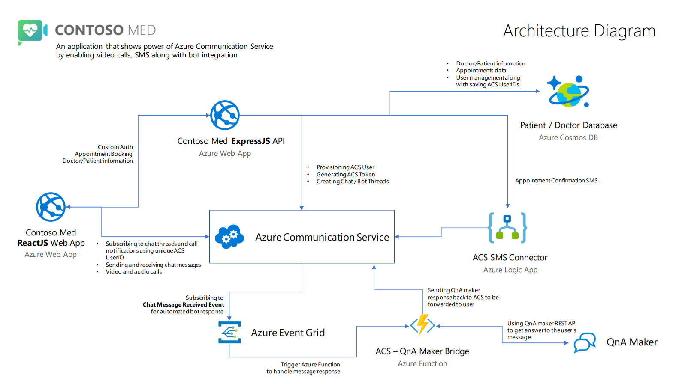
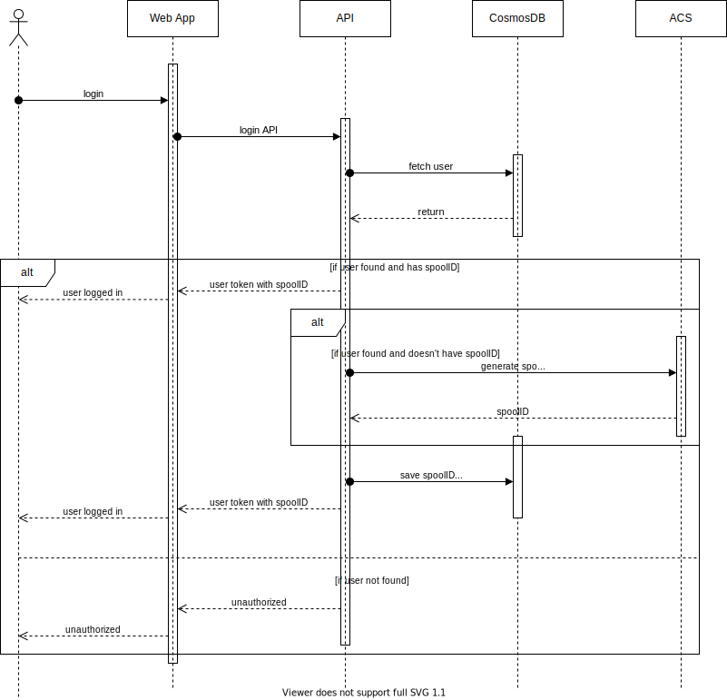
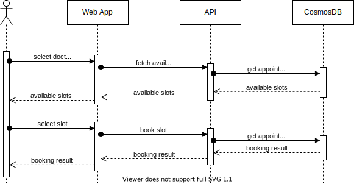

# Azure Communication Services Demo with Contoso Med App

This is a sample application showing how quickly and easily it is to add the Azure Communication Services to a Telemedicine application using the Azure Communications Javascript SDK and some other Azure services on a react app [Contoso Med App](./contoso-web-app/) with a backend service [ACS Node](./contoso-node-api) built using Node.js and Express.js that helps the client-side application connect to Azure.

## Application Architecture

## Features
### Azure Communication Service specific features
- SMS service on appointment booking.
- Chat service
    - Chat between Patient and QnA Bot.
    - Add doctor to the patient - bot conversation
    - Chat between Patient and Doctor.
- Calling between Patient and Doctor.

### General features
- User authentication.
- View doctors and book appointments.
- Chat with QnA bot to book appointment or start a support consultation.

### Critical sequences
#### Login
&nbsp;

&nbsp;
#### Booking Appointment
&nbsp;

&nbsp;
#### Chatting and Calling via Azure Communication Service
&nbsp;

&nbsp;
##  Set Up
- [Contoso Med Web App](./contoso-web-app/) - To set-up the client-side application
- [Contoso Med API](./contoso-node-api) - To set-up the backend service
- [QnA Maker Bridge](./contoso-az-functions) - To set-up a bridge between your QnA bot and Azure Communication Services using Azure Functions

## Additional Reading
- [What is Azure Communication Services?](https://docs.microsoft.com/en-us/azure/communication-services/overview#compare-azure-communication-services) - Know more about Azure Communication Services
- [Azure Communication Service on GitHub](https://github.com/Azure/Communication) - See latest Samples, SDKs, Release Notes, Ask questions or file issues here
- [React](https://reactjs.org/) - Library for building user interfaces
- [Node.js](https://nodejs.org/) - Server-side scripting language
- [Express.js](https://expressjs.com/) - Web application framework for NodeJS
