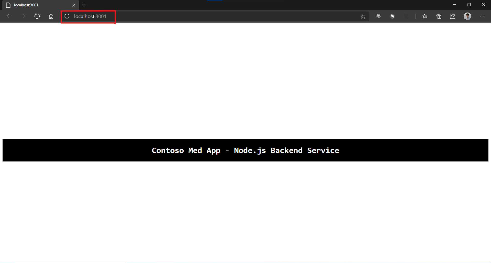

# Contoso Med App Node.js Backend Service

 *Backend Service running locally at http://localhost:3001/*

## Introduction
This is the backend service for the [Contoso Med App](../contoso-web-app/) built on Node.js. This connects the client-side application with Azure Communication Services, QnA maker and Azure CosmosDB.

### This backend service provides APIs for the following
### General APIs
- User authentication
- Doctor and patient information
- Appointment booking
- Appointments information

### Azure Communication Service specific APIs
- User ID and token generation
- Chat thread initialization

Starting the backend server requires having 
[NodeJs](https://nodejs.org/en/) installed.

### Configuration
Follow the steps below before running the solution
 
Fill configuration information in the `config.json` file

```JSON
{
    "mongodbConnection":"<COSMOS_DB_OR_MONGODB_CONNECTION_STRING>",
    "dbName": "<DATABASE_NAME>",
    "connectionString": "<AZURE_COMMUNICATION_SERVICES_CONNECTION_STRING>",
    "jwtPrivateKey": "<JWT_PRIVATE_KEY_FOR_AUTHENTICATION>",
    "endpoint": "<AZURE_COMMUNICATION_SERVICES_ENDPOINT>",
    "smsLogicAppEndpoint": "<AZURE_COMMUNICATION_SERVICES_SMS_LOGIC_APP_HTTP_TRIGGER_ENDPOINT>",
    "qnaMakerEndpoint": "<QNA_MAKER_ENDPOINT_URL>",
    "qnaMakerEndpointKey": "<QNA_MAKER_ENDPOINT_KEY>"
}

```

### Initializing new database
In `app.js`, find following database connection code
```Javascript
console.log('connecting to cosmosdb...')
dbClient.connect()
  .then(() => {
    console.log("connected to the database successfully")

    /* uncomment next line to reset database when application
     * starts. Appointments in db are flushed and regenerated */
    //dbInitializationService.initializeDB();
  })
  .catch((e) => {
    console.log(e)
  })
```

Uncomment `dbInitializationService.initializeDB()` line if you are connecting to a new database to seed the database with mock patients and doctors data.

You can also reset database by going to `https://{hosted_url}/reset` endpoint.

After you have configured everything, run

```
npm install
```

and then,

```
npm run start
```
from the [contoso-node-api](./contoso-node-api) directory, this runs the node service on port 3000 at ``` http://localhost:3000 ```
