# Contoso Med App built using React

## Introduction
This is the front-end application of Contoso Med created using React with QnA bot, ACS chat, SMS and call integration.

Starting the react app requires two steps. It requires that you have `npm` and 
`nodejs` installed on your machine and make sure you have `react` and 
`react-scripts` installed globally. You can download Nodejs from 
[NodeJs](https://nodejs.org/en/) website and once you have it installing 
`react` and `react-scripts` will be like below

```
npm install -g react react-scripts 
```
Before starting the react app you need to change the configuration in the ` config.js ` file, the endpoint should point to your API service. If you are running locally then use `http://localhost:3001`. 3001 being the default port on which server runs locally.

After the configuration is done, run

```
npm install
```

and then,

```
npm start
```
 from the `contoso-med-app` app directory.


## Using the app
Once the Node service and the react app are all set-up and running you can goto ``` http://localhost:3000 ``` to access the app. This would take you to the login page of the app.

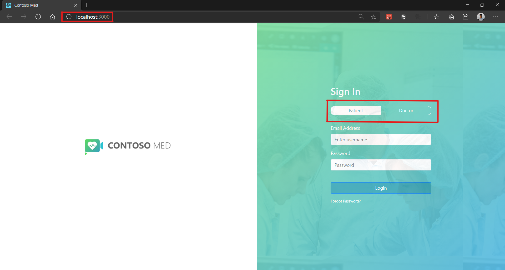<br/>*Contoso Med App running locally at http://localhost:3000/*

Here you can login as a patient or a doctor by using the toggle. User credentials can be found in the [init.json](../contoso-node-api/db/init.json) file.

Once you're logged in you will see the dashboard of the patient or doctor.

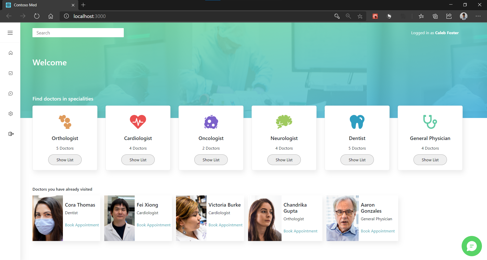<br/>
*Patient dashboard*
___

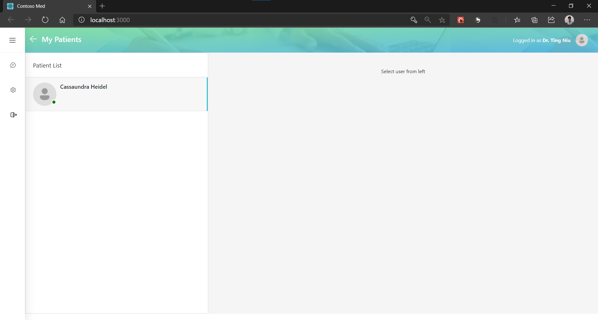<br/>
*Doctor dashboard*

Once logged in as a patient you can communicate with the chat bot using the chat bubble at the bottom-right on the patient dashboard or book an appointment from the list of doctors.

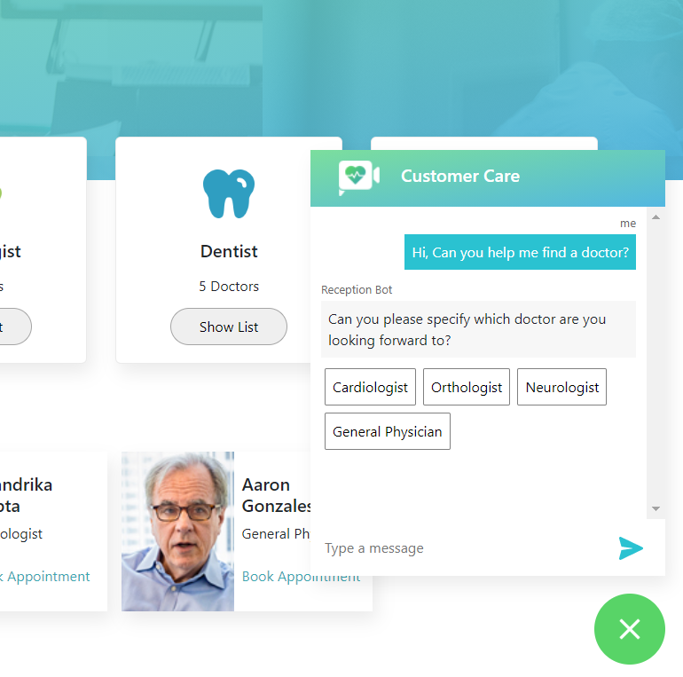<br/>
*QnA Bot on patient dashboard*
___

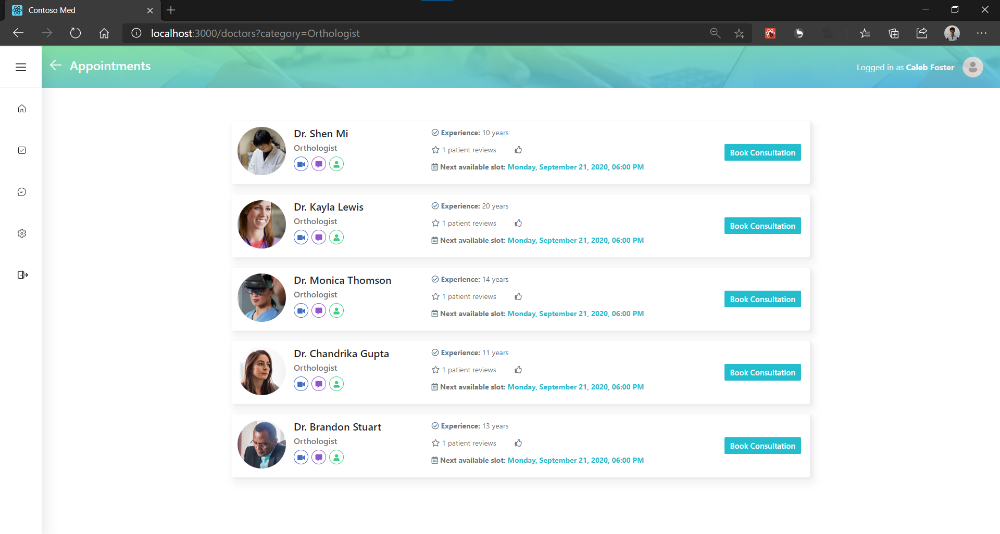<br/>*Doctor list to book appointments*
___

On clicking ``` Book Consultation ``` you'll be redirected to the ``` Book Appointment ``` page, here you can select a slot for your appointment and on selecting slot your appointment summary is shown on the right there you also have an option to receive SMS confirmation of your booking. On clicking ``` Confirm Appointment ``` a confirmation SMS is sent to the provided phone number.

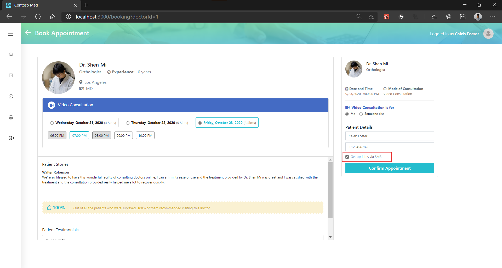<br/>*Appointment booking page with option to receive SMS confirmation of your appointment*

___

Once the appointment is booked you can view all your appointments on the ``` My Bookings ``` page as shown below.

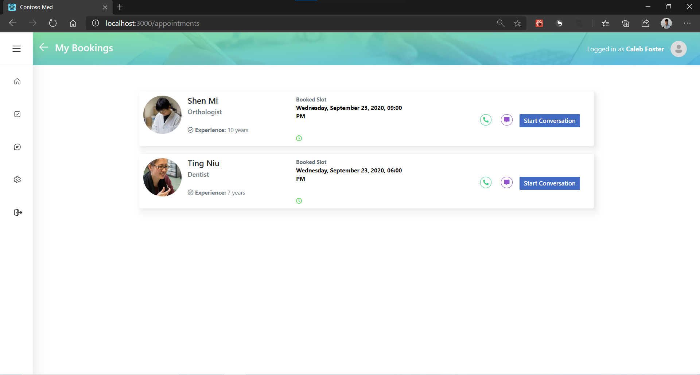<br/>*Booked appointments page*

You can navigate to ``` Chat dashboard ``` and ``` My Bookings ``` from the side navigation menu. To start a conversation with doctors you have an appointment with navigate to the ``` Chat dashboard ``` or you can view all your bookings from the ``` My Bookings ``` page and click ``` Start Conversation ``` from the appointment list.

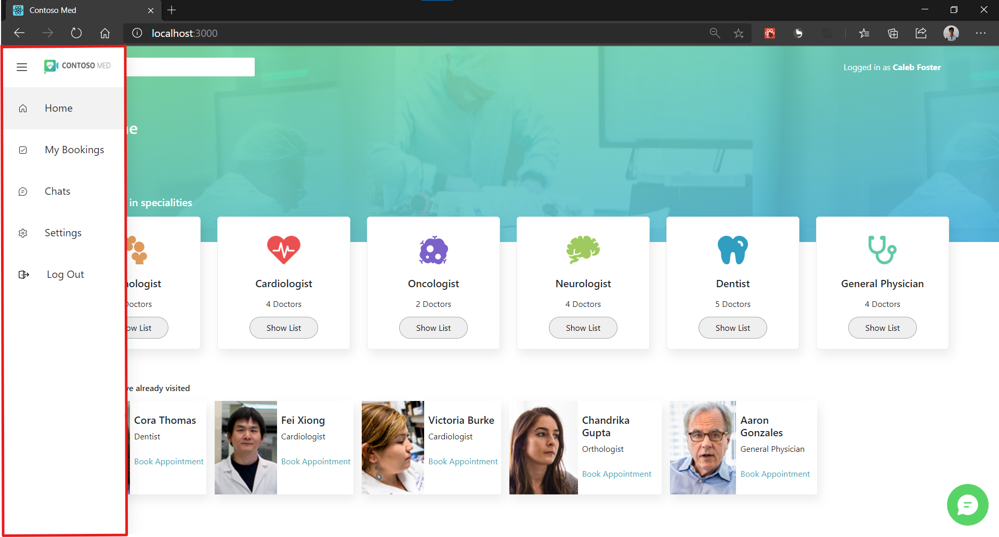*Side Navigation menu*

___

You can start a conversation by clicking on the patient card on doctor side and vice-versa and also place audio and video calls.

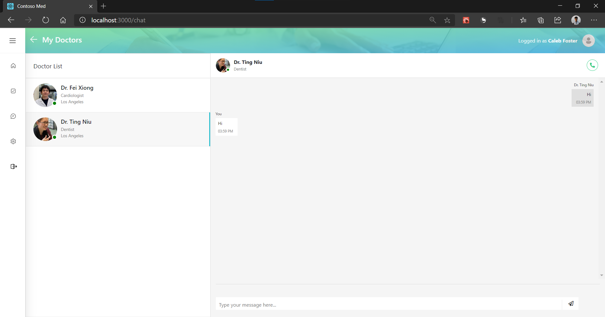<br />*Chat on patient side with doctor*
___

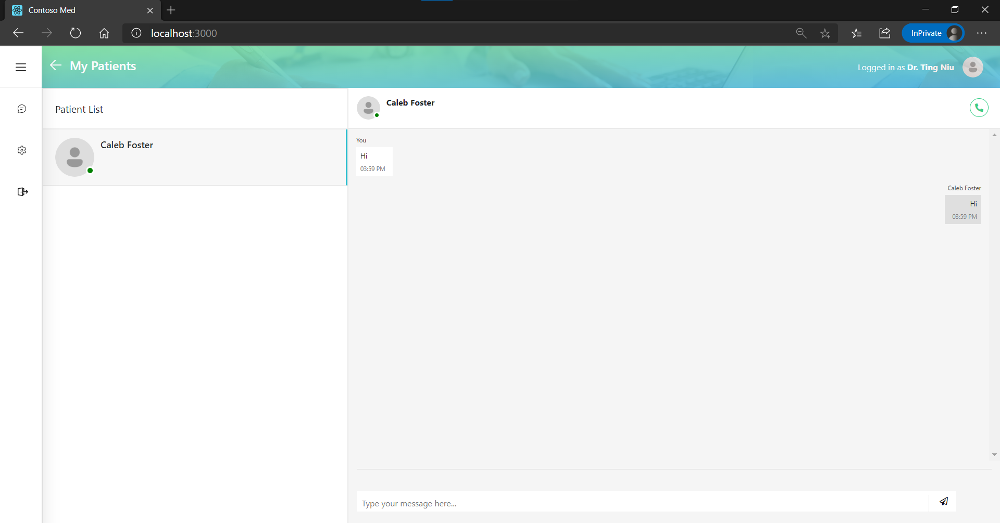<br />*Chat on doctor side with patient*

__

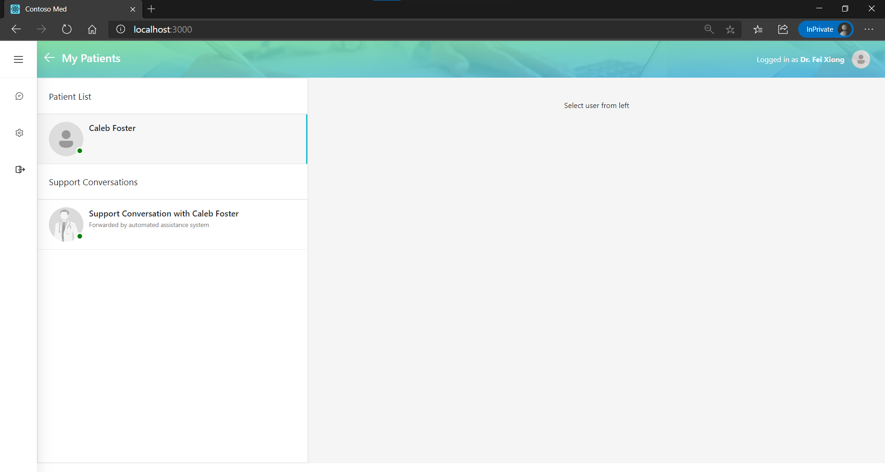<br />*Support conversation forwarded to doctor by QnA bot*

** Support Conversations are conversations which are passed on by the QnA bot to the doctor. Doctor needs to be logged in and active to receive the support conversation on their dashboard.

